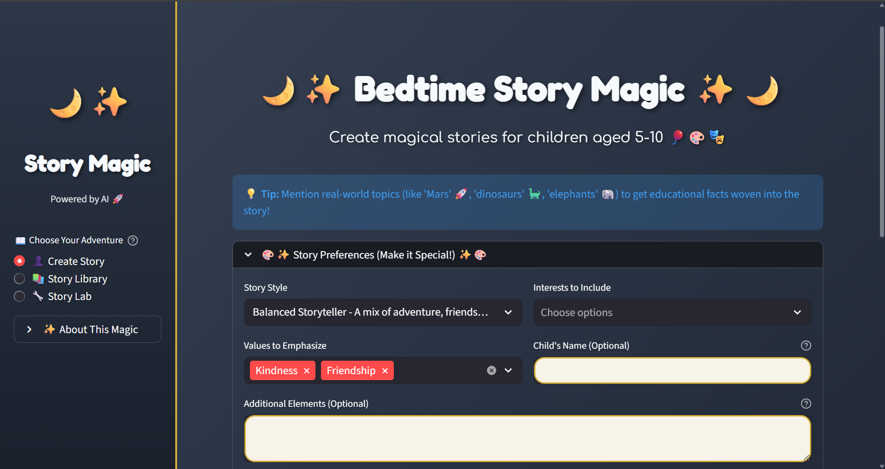
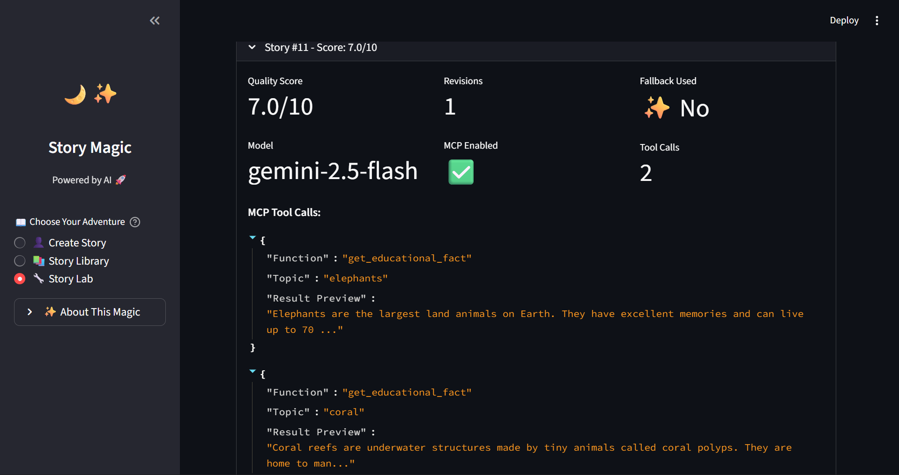
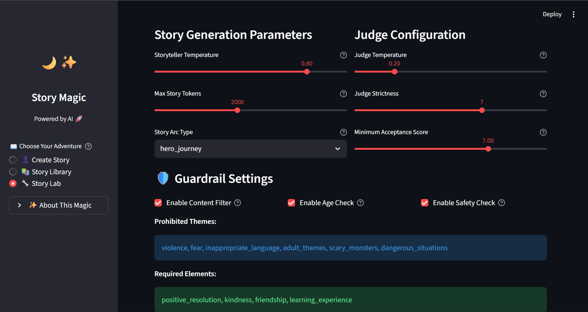

# 🌙 Agentic Bedtime Story Generator

A sophisticated AI-powered bedtime story generator for the Google Agentic AI Hackathon, featuring **Google Gemini 2.5 Flash**, **Model Context Protocol (MCP)** integration, and **Ollama fallback** for resilience.

## 🎯 Overview

This project demonstrates a hybrid agentic architecture that:
- Uses **Google Gemini 2.5 Flash** (Free Tier) for story generation
- Integrates **Model Context Protocol (MCP)** to ground stories in real educational facts
- Implements **Ollama fallback** for resilience when API calls fail
- Features an **iterative refinement loop** with an LLM judge for quality assurance

## 🚀 Quick Start

### Prerequisites

- Python 3.8+
- Google AI API key (for Gemini) - [Get one here](https://makersuite.google.com/app/apikey)
- (Optional) Ollama installed locally for fallback - [Install Ollama](https://ollama.ai)

### Installation

```bash
# Install dependencies
pip install -r requirements.txt

# Create .env file with your API key in the src/ directory
cd src
echo "GEMINI_API_KEY=your_key_here" > .env
```

### Running the Application

**Streamlit UI (Recommended):**
```bash
cd src
streamlit run app.py
```

Or via main.py:
```bash
cd src
python main.py streamlit
```

**Command Line Interface:**
```bash
cd src
python main.py
```

## 🏗️ Architecture

### Key Components

1. **Storyteller Agent** (`agents.py`)
   - Uses Gemini 2.5 Flash for story generation
   - Configured with system instructions for age-appropriate content
   - Integrates with MCP tools for educational facts

2. **MCP Server** (`mcp_server.py`)
   - Provides `get_educational_fact` tool
   - Returns hardcoded educational facts about space, dinosaurs, animals, etc.
   - Grounds stories in reality

3. **MCP Client** (`mcp_client.py`)
   - Connects Gemini to MCP tools
   - Handles tool calling loop: Prompt → Tool Call → Execute → Feed back

4. **Judge Agent** (`agents.py`)
   - Evaluates story quality (1-10 scale)
   - Provides detailed feedback for refinement
   - Determines if story meets quality threshold (≥7.0)

5. **Orchestrator** (`orchestration.py`)
   - Manages the Storyteller → Judge → Refinement loop
   - Handles fallback to Ollama when Gemini fails
   - Coordinates tool calls and iterative refinement

6. **Local Backup** (`local_backup.py`)
   - Ollama fallback system
   - Activates when Gemini API is unavailable
   - Ensures system resilience

### Workflow

```
User Request
    ↓
Storyteller Agent (Gemini)
    ↓
[MCP Tool Call] → Educational Facts
    ↓
Story Generation
    ↓
Judge Evaluation
    ↓
Score ≥ 7.0? → Yes → Final Story
    ↓ No
Refinement Loop (max 3 iterations)
    ↓
Final Story
```

## ✨ Key Features

### 1. Model Context Protocol (MCP) Integration
- **Innovation Highlight**: The Storyteller Agent automatically queries the MCP server when real-world topics are mentioned
- Example: If a child asks for a story about Mars, the agent fetches real Mars facts and weaves them into the narrative
- Makes stories both entertaining and educational
- **Fact Checker Agent**: Verifies educational facts for accuracy and age-appropriateness
- **MCP Expander**: Semantic topic matching for broader coverage

### 2. Hybrid Architecture
- **Primary**: Google Gemini 2.5 Flash (cloud-based, powerful)
- **Fallback**: Local Ollama model (resilient, privacy-preserving)
- Automatic failover ensures the system always works

### 3. Iterative Refinement
- LLM Judge evaluates each story (1-10 scale)
- Stories below threshold (7.0) are automatically refined
- Maximum 3 refinement iterations
- Detailed feedback guides improvements

### 4. Age-Appropriate Content
- Designed for children ages 5-10
- Simple vocabulary and clear structure
- Positive messaging and safe themes
- Educational value through MCP integration

### 5. Text-to-Speech (Read-Along)
- **Play button** for Gemini-generated stories
- Browser-based speech synthesis
- Child-friendly voice selection
- Perfect for bedtime reading

### 6. SQLite Database
- Persistent storage of all stories and runs
- Analytics and statistics tracking
- Story history and search functionality
- Generation metrics and performance data

### 7. Parent Settings & Preferences
- Customizable personas (Adventurous Explorer, Creative Dreamer, etc.)
- Values selection (Kindness, Friendship, Courage, etc.)
- Interests (Animals, Space, Dinosaurs, etc.)
- Child name customization
- Technical hyperparameter tuning in debug mode

## 📁 Project Structure

```
agentic-google-hackathon/
├── src/
│   ├── main.py           # Entry point (Streamlit/CLI)
│   ├── app.py            # Streamlit UI application
│   ├── orchestration.py  # Storyteller → Judge → Refinement loop
│   ├── agents.py         # Gemini 2.5 Flash client setup
│   ├── mcp_server.py     # Educational Facts MCP server
│   ├── mcp_client.py     # Gemini-MCP integration
│   ├── mcp_expander.py   # Topic expansion and semantic matching
│   ├── fact_checker.py   # Fact verification agent
│   ├── local_backup.py   # Ollama fallback logic
│   ├── database.py       # SQLite database for story storage
│   ├── parent_config.py  # Parent settings and preferences
│   ├── config.py         # Configuration parameters
│   └── setup_check.py    # Environment verification script
├── images/               # Screenshots and diagrams
├── README.md             # This file
├── ARCHITECTURE.md       # Detailed architecture explanation
├── EXPLANATION.md        # Design decisions
├── DEMO.md               # Demo video and script
└── requirements.txt      # Dependencies
```

## 🔧 Configuration

### Environment Variables

Create a `.env` file in the `src/` directory:

```env
GEMINI_API_KEY=your_google_ai_api_key_here
```

### MCP Server

The MCP server runs as part of the application. To run it standalone:

```bash
cd src
python mcp_server.py
```

### Ollama Setup (Optional)

For fallback functionality:

```bash
# Install Ollama
curl -fsSL https://ollama.ai/install.sh | sh

# Pull a model
ollama pull llama3.2
```

## 📚 Educational Facts Database

The MCP server includes hardcoded facts about:

- **Space**: Mars, Moon, Sun, Stars, Planets
- **Dinosaurs**: T-Rex, Triceratops, Brachiosaurus, Stegosaurus
- **Animals**: Elephants, Whales, Penguins, Lions, Dolphins
- **Ocean**: Coral, Sharks, Octopus

## 🎬 Demo Video

**Watch the Demo**: https://youtu.be/S0Szdqgfk5A

A 3-5 minute video demonstration of the Agentic Bedtime Story Generator, showcasing:
- Architecture overview and MCP integration
- Live story generation with MCP tool calling
- Automatic fallback to Ollama
- Code walkthrough of key components

See [DEMO.md](DEMO.md) for detailed timestamps and demo script.

## 📸 Screenshots

### Main Story Interface

*The main Streamlit interface showing generated stories with metadata, quality scores, and story history.*

### MCP Observability

*Real-time observability of MCP tool calls, showing how educational facts are retrieved and integrated into stories.*

### Hyperparameter Tuning & Debug Mode

*Advanced debug mode with hyperparameter tuning controls for fine-tuning story generation parameters.*

## 🎓 Hackathon Submission Details

### Innovation: Model Context Protocol Integration
- First-of-its-kind integration of MCP with Gemini for educational storytelling
- Demonstrates how agents can ground narratives in real-world facts
- Shows the power of tool-calling in agentic workflows

### Resilience: Hybrid Cloud + Local Architecture
- Automatic failover from Gemini to Ollama
- Ensures system availability even during API outages
- Privacy-preserving local option

### Quality: Iterative Refinement Loop
- LLM-based judge ensures high-quality output
- Automatic refinement based on feedback
- Production-ready quality assurance

## 🐛 Troubleshooting

### Gemini API Issues
- Check your API key in `.env`
- Verify API quota hasn't been exceeded
- System will automatically fallback to Ollama

### Ollama Not Working
- Ensure Ollama is installed: `ollama --version`
- Pull a model: `ollama pull llama3.2`
- Check if Ollama service is running

### MCP Tool Not Called
- Verify `enable_mcp=True` in orchestrator
- Check that topics match the educational facts database
- Review tool call history in output

## 📝 License

This project is developed for the Google Agentic AI Hackathon.

## 🙏 Acknowledgments

- Google Gemini 2.5 Flash for powerful story generation
- FastMCP for MCP server implementation
- Ollama for local model fallback

---

**Note**: Remember to add your `GEMINI_API_KEY` to the `.env` file. Never commit API keys to version control.

